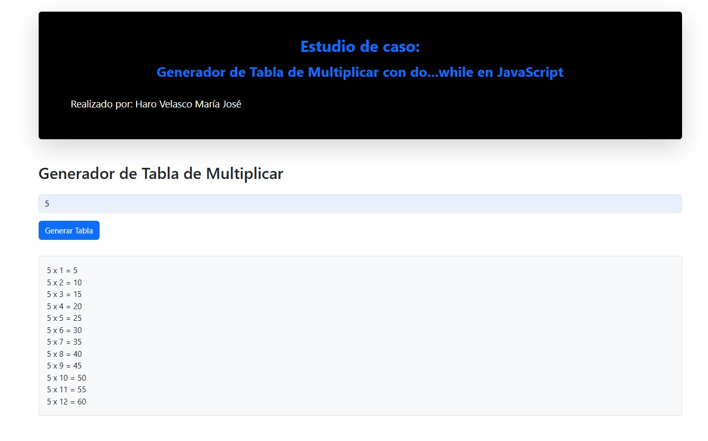

## Estudio de caso: Generador de Tabla de Multiplicar con do...while en JavaScript
Requisitos de finalización
Apertura: miércoles, 19 de noviembre de 2025, 00:00
Cierre: lunes, 24 de noviembre de 2025, 17:00
Descripción:
Cree una pequeña aplicación web que genere una tabla de multiplicar usando el ciclo do...while en JavaScript. El usuario deberá ingresar un número en una caja de texto y, al presionar el botón "Generar Tabla", se mostrará la tabla del 1 al 12.

## Requerimientos obligatorios:

Utilizar HTML + JavaScript.
Usar Bootstrap para el diseño (botones, inputs y estructura general).
Debe existir:
Una caja de texto donde el usuario ingrese el número de la tabla (solo uno).
Un botón “Generar Tabla”.
Un área donde se muestre la tabla generada.
La tabla se debe generar utilizando exclusivamente un ciclo do...while.
Validar que el usuario ingrese un número; si no, mostrar un mensaje de advertencia usando clases de Bootstrap.
## Resultado esperado:
Cuando el usuario escriba por ejemplo 7 y haga clic en “Generar Tabla”, deberá mostrar:

7 x 1 = 7

7 x 2 = 14

...

7 x 12 = 84

## Objetivo de aprendizaje:
Comprender el uso del ciclo do...while, manejo básico del DOM y formularios simples con Bootstrap.


  ```javascript
// Ciclo do...while para generar la tabla
do {
    tablaHTML += `${n} x ${i} = ${n * i}<br>`;
    i++;
} while (i <= 12);

  ```  



